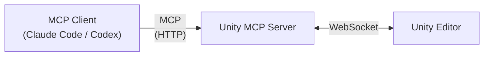

# Unity MCP

Unity MCP bridges Unity Editor and MCP clients (Claude, Codex, etc.) through the [Model Context Protocol](https://modelcontextprotocol.io/).
It provides practical tools that make the development cycle more efficient.



## Available Tools

| Tool               | What it does                                    |
| ------------------ | ----------------------------------------------- |
| `read_console`     | Reads Unity console entries.                    |
| `clear_console`    | Clears Unity Console log entries.               |
| `refresh_assets`   | Refreshes Unity Editor assets.                  |
| `run_tests`        | Starts Unity tests as a cancellable job.        |
| `get_editor_state` | Returns current server/editor connection state. |
| `get_job_status`   | Checks state/result of a submitted test job.    |
| `cancel_job`       | Requests cancellation for a running/queued job. |

## Prerequisites

- Unity Editor (Unity 6+ recommended)
- .NET SDK 8+

## Quick Start

1. Install the Unity package.
2. Set up a project-local `dotnet tool` version (pinned per project):
   ```bash
   dotnet new tool-manifest
   dotnet tool install --local Doyasu24.UnityMcp.Tool --version 0.1.0
   ```
3. Start the Unity MCP server (default port: `48091`):
   ```bash
   dotnet tool run unity-mcp
   ```
4. Register the server in your MCP client:
   - Claude Code: follow `Claude Code Setup`.
   - Codex: follow `Codex Setup`.
5. Open your Unity project and make sure the Unity MCP plugin is enabled.
6. In your MCP client, call `get_editor_state` to verify the connection.
7. Start using tools such as `read_console` and `run_tests`.

### Install the Unity Package

Add to Package Manager:

`https://github.com/doyasu24/unity-mcp.git?path=UnityMCPPlugin/Assets/Plugins/UnityMCP#v0.1.0`

### Claude Code Setup

Run:

```bash
claude mcp add -s project --transport http unity-mcp http://127.0.0.1:48091/mcp
```

Then restart Claude Code session (or open a new one) and confirm the `unity-mcp` server is available.

### Codex Setup

Run:

```bash
codex mcp add unity-mcp --url http://127.0.0.1:48091/mcp
```

Then verify the server is registered:

```bash
codex mcp list
```

## Configuration

Use this section only when you need a custom port.

### Server Port

- Default port: `48091`.
- Use `--port` only when you need a non-default port.
- Example:
  ```bash
  dotnet tool run unity-mcp --port 48092
  ```

### Unity Plugin Settings

Change the port from the Unity editor window:

`Unity MCP Settings`

The setting is stored in:

`ProjectSettings/UnityMcpPluginSettings.asset`

Rules:

- `port` in Unity settings must match the server port.
- The server runs on `127.0.0.1` (local machine).
- This settings asset is project-scoped and should be committed to version control.

## Tool Version Management (Project-Scoped)

- Commit `.config/dotnet-tools.json` to version-control to pin the server version per project.
- Team members should run:
  ```bash
  dotnet tool restore
  ```
- To update to a new pinned version:
  ```bash
  dotnet tool update --local Doyasu24.UnityMcp.Tool --version <NEXT_VERSION>
  ```

## Using Multiple Unity Editors

In multi-editor workflows, use **1 Editor = 1 MCP Server**.

That means:

- Each Unity Editor instance uses its own server instance.
- Each server/editor pair must use a unique port.
- Your MCP client must register one server entry per Unity project/editor.

Example:

| Unity Project | Server Port | Claude/Codex Server Name | MCP URL                      |
| ------------- | ----------- | ------------------------ | ---------------------------- |
| Project A     | 48091       | `unity-a`                | `http://127.0.0.1:48091/mcp` |
| Project B     | 48092       | `unity-b`                | `http://127.0.0.1:48092/mcp` |

CLI examples:

### Claude Code

```bash
claude mcp add -s project --transport http unity-a http://127.0.0.1:48091/mcp
claude mcp add -s project --transport http unity-b http://127.0.0.1:48092/mcp
```

### Codex

```bash
codex mcp add unity-a --url http://127.0.0.1:48091/mcp
codex mcp add unity-b --url http://127.0.0.1:48092/mcp
```

## Troubleshooting

### MCP client cannot connect

- Confirm the server is running.
- Confirm the client URL matches your server port.
- Check that nothing else is using the same port.

### Unity and server are not linked

- Confirm Unity plugin `port` equals server `--port`.
- Restart Unity and the server after changing the port.

### Wrong Unity project responds in multi-editor setup

- Verify each project uses a different port.
- Verify your MCP client is targeting the intended server entry (`unity-a`, `unity-b`, etc.).
