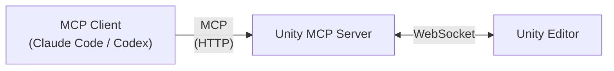

# Unity MCP

Unity MCP bridges Unity Editor and MCP clients (Claude, Codex, etc.) through the [Model Context Protocol](https://modelcontextprotocol.io/).
It provides practical tools that make the development cycle more efficient.


```mermaid
graph LR
    A["MCP Client<br/>(Claude Code / Codex)"] -->|"MCP<br/>(HTTP)"| B["Unity MCP Server"]
    B <-->|"WebSocket"| C["Unity Editor"]
```

## Available Tools

| Tool | What it does |
| --- | --- |
| **Editor Control** | |
| `get_editor_state` | Returns current server/editor connection state. |
| `get_play_mode_state` | Read-only: gets current Unity Editor play mode state. |
| `control_play_mode` | Edit: controls Unity Editor play mode (start, stop, pause). |
| `read_console` | Reads Unity console entries. |
| `clear_console` | Clears Unity Console log entries. |
| `refresh_assets` | Refreshes Unity Editor assets. Waits for recompilation if scripts changed. Returns errors when present. |
| `run_tests` | Runs Unity tests and returns the result. |
| **Scene Management** | |
| `list_scenes` | Lists all scene files in the Unity project. |
| `open_scene` | Opens a scene in the Unity Editor. |
| `save_scene` | Saves the current scene or a specific open scene. |
| `create_scene` | Creates a new scene and saves it to the specified path. |
| **Scene / Prefab Hierarchy & Components** | |
| `get_hierarchy` | Returns the scene's or a Prefab asset's GameObject tree with component type names. Supports pagination via `offset`. Pass `prefab_path` for Prefab mode. |
| `get_component_info` | Returns serialized field values of a specific component on a scene or Prefab GameObject. |
| `manage_component` | Adds, updates, removes, or reorders components on a scene or Prefab GameObject. |
| `manage_game_object` | Creates, updates, deletes, or reparents GameObjects in the active scene or a Prefab asset. |
| `find_game_objects` | Searches for GameObjects in the active scene or a Prefab asset by name, tag, or component type. Supports pagination via `offset`. |
| `instantiate_prefab` | Instantiates a Prefab asset into the active scene, maintaining the Prefab link. |
| **Asset Search & Info** | |
| `find_assets` | Searches for assets in the project using AssetDatabase filter syntax. Supports pagination via `offset`. |
| `get_asset_info` | Returns detailed metadata for a Unity asset at the specified path. |
| `manage_asset` | Creates or deletes Unity assets, and manages material properties: get/set shader properties, change shaders, and control shader keywords. |
| `manage_prefab` | Creates, applies, or reverts Prefab assets. |
| **Build** | |
| `manage_build` | Manages Unity build pipeline: get/set build settings, add/remove/reorder scenes, and execute builds. |
| **Screenshot** | |
| `capture_screenshot` | Captures a screenshot from Game View or Scene View. Returns the image inline (base64 PNG) so the LLM can see it directly, and also saves a copy to `<project>/Screenshots/`. |

## Pagination

Tools that return large result sets support offset-based pagination via the optional `offset` parameter. When a response is truncated (`truncated: true`), it includes a `next_offset` value that can be passed as `offset` in the next call to fetch the next page.

**Supported tools:** `get_hierarchy`, `find_assets`, `find_game_objects`

Example flow:
1. Call `find_assets` with `filter: "t:Material"`, `max_results: 5` → response includes `next_offset: 5`, `total_count: 42`
2. Call `find_assets` with `filter: "t:Material"`, `max_results: 5`, `offset: 5` → next page of results

For `get_hierarchy`, when `offset > 0` the response returns a flat `game_objects` array instead of the nested tree format, with each node including its `path` for identification. When `offset` is `0` (default), the response format is unchanged.

## Prerequisites

- Unity Editor (Unity 6+ recommended)
- .NET SDK 8+

## Quick Start

1. Install the Unity package.
2. Set up a project-local `dotnet tool` version (pinned per project):
   ```bash
   dotnet new tool-manifest
   dotnet tool install --local Doyasu24.UnityMcp.Tool --version 0.1.3
   ```
3. Start the Unity MCP server (default port: `48091`):
   ```bash
   dotnet tool run unity-mcp
   ```
4. Register the server in your MCP client:
   - Claude Code: follow `Claude Code Setup`.
   - Codex: follow `Codex Setup`.
5. Open your Unity project and make sure the Unity MCP plugin is enabled.
6. In your MCP client, call `get_editor_state` to verify the connection.
7. Start using tools such as `read_console` and `run_tests`.

### Install the Unity Package

Add to Package Manager:

`https://github.com/doyasu24/unity-mcp.git?path=UnityMCPPlugin/Assets/Plugins/UnityMCP#v0.1.3`

### Claude Code Setup

Run:

```bash
claude mcp add -s project --transport http unity-mcp http://127.0.0.1:48091/mcp
```

Then restart Claude Code session (or open a new one) and confirm the `unity-mcp` server is available.

### Codex Setup

Run:

```bash
codex mcp add unity-mcp --url http://127.0.0.1:48091/mcp
```

Then verify the server is registered:

```bash
codex mcp list
```

## Configuration

Use this section only when you need a custom port.

### Server Port

- Default port: `48091`.
- Use `--port` only when you need a non-default port.
- Example:
  ```bash
  dotnet tool run unity-mcp --port 48092
  ```

### Unity Plugin Settings

Change the port from the Unity editor window:

`Unity MCP Settings`

The setting is stored in:

`ProjectSettings/UnityMcpPluginSettings.asset`

Rules:

- `port` in Unity settings must match the server port.
- The server runs on `127.0.0.1` (local machine).
- This settings asset is project-scoped and should be committed to version control.

## Tool Version Management (Project-Scoped)

- Commit `.config/dotnet-tools.json` to version-control to pin the server version per project.
- Team members should run:
  ```bash
  dotnet tool restore
  ```
- To update to a new pinned version:
  ```bash
  dotnet tool update --local Doyasu24.UnityMcp.Tool --version <NEXT_VERSION>
  ```

## Using Multiple Unity Editors

In multi-editor workflows, use **1 Editor = 1 MCP Server**.

That means:

- Each Unity Editor instance uses its own server instance.
- Each server/editor pair must use a unique port.
- Your MCP client must register one server entry per Unity project/editor.

Example:

| Unity Project | Server Port | Claude/Codex Server Name | MCP URL                      |
| ------------- | ----------- | ------------------------ | ---------------------------- |
| Project A     | 48091       | `unity-a`                | `http://127.0.0.1:48091/mcp` |
| Project B     | 48092       | `unity-b`                | `http://127.0.0.1:48092/mcp` |

CLI examples:

### Claude Code

```bash
claude mcp add -s project --transport http unity-a http://127.0.0.1:48091/mcp
claude mcp add -s project --transport http unity-b http://127.0.0.1:48092/mcp
```

### Codex

```bash
codex mcp add unity-a --url http://127.0.0.1:48091/mcp
codex mcp add unity-b --url http://127.0.0.1:48092/mcp
```

## Troubleshooting

### MCP client cannot connect

- Confirm the server is running.
- Confirm the client URL matches your server port.
- Check that nothing else is using the same port.

### Unity and server are not linked

- Confirm Unity plugin `port` equals server `--port`.
- Restart Unity and the server after changing the port.

### Wrong Unity project responds in multi-editor setup

- Verify each project uses a different port.
- Verify your MCP client is targeting the intended server entry (`unity-a`, `unity-b`, etc.).

## Screenshots

`capture_screenshot` saves PNG files to `<your-unity-project>/Screenshots/`. Add this directory to your `.gitignore`:

```gitignore
/Screenshots/
```
